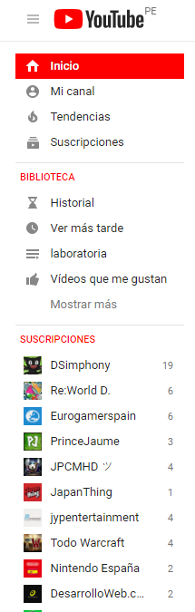
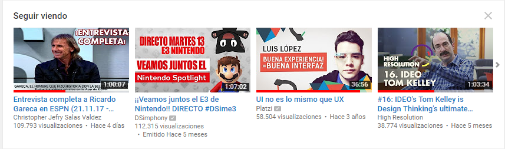
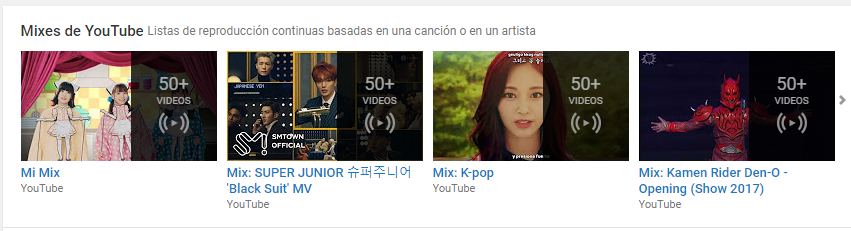
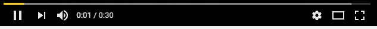
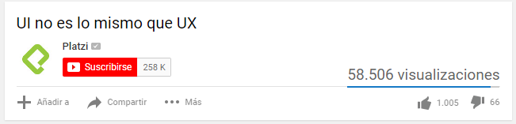
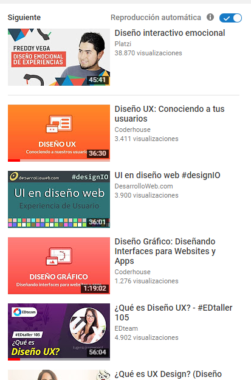
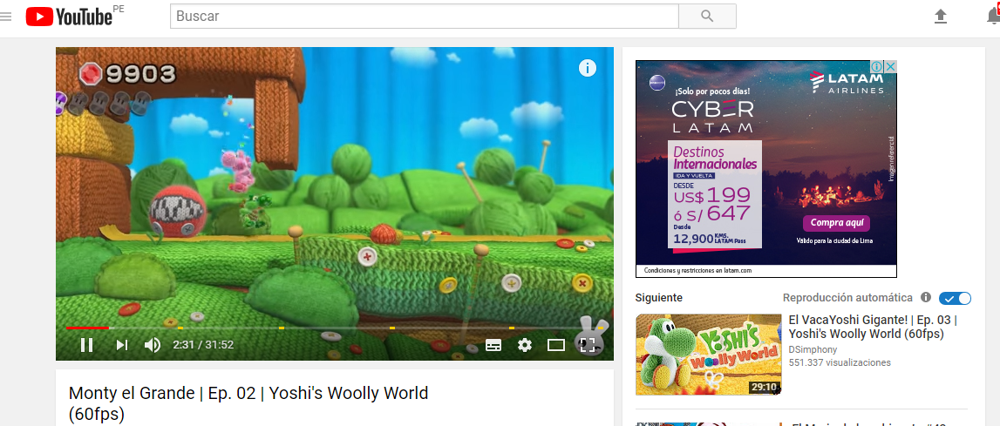
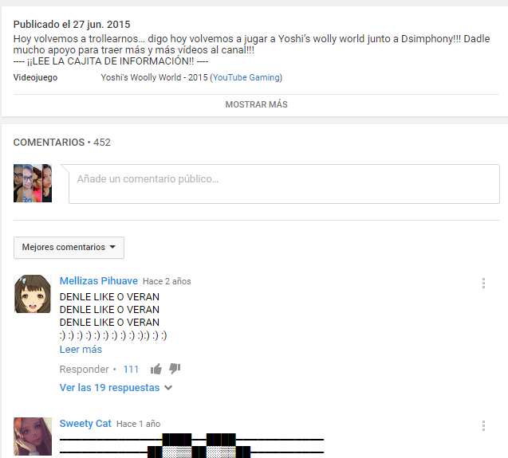
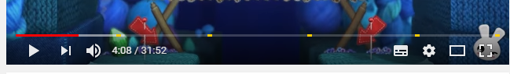

# RETO N°1
explica qué partes conforman el UX y qué partes el UI.

## Página elegida:

### que es UX?
+ visualización de los videos sin estar logueados
+ Barra lateral que nos permite ver los videos guardados, historia y las suscripciones del usuario.
+ ver un extracto del video antes de la reproducción.

+ te muestra los ultimos videos visualiados.

+ te brinda listas de reproduccion basados en tus busquedas.

+ se puede cambiar la calidad del video, ademas se cambia automaticamente a la calidad minima si la velocidad de conexion de internet ha bajado.

+ facil control del video, activar subtitulos, cambiar el tamaño de visualización.

+ opciones de compartir con mis redes sociales, suscribirse, dar like y dislike, añadir el video a listas de reproduccion propias.

+ videos recomendados segun el tema que estoy viendo, opcion de reproducir automaticamente videos del mismo canal.

+ la barra de busqueda siempre esta presente.

+ informacion sobre el video y la opcion de dejar un comentario, asi como la visualiacion de comentarios de otros usuarios.

+ Poder subir videos a tu canal

### que es UI?
+ los colores de la pagina van a juego con el logo.
+ al avanzar el video la barra se pinta de color rojo.

+ diseño del menu y los botones.
+ tipografia, tamaño de letra, bordes.
+ imagenes bien posicionadas y de tamaño adecuado.
